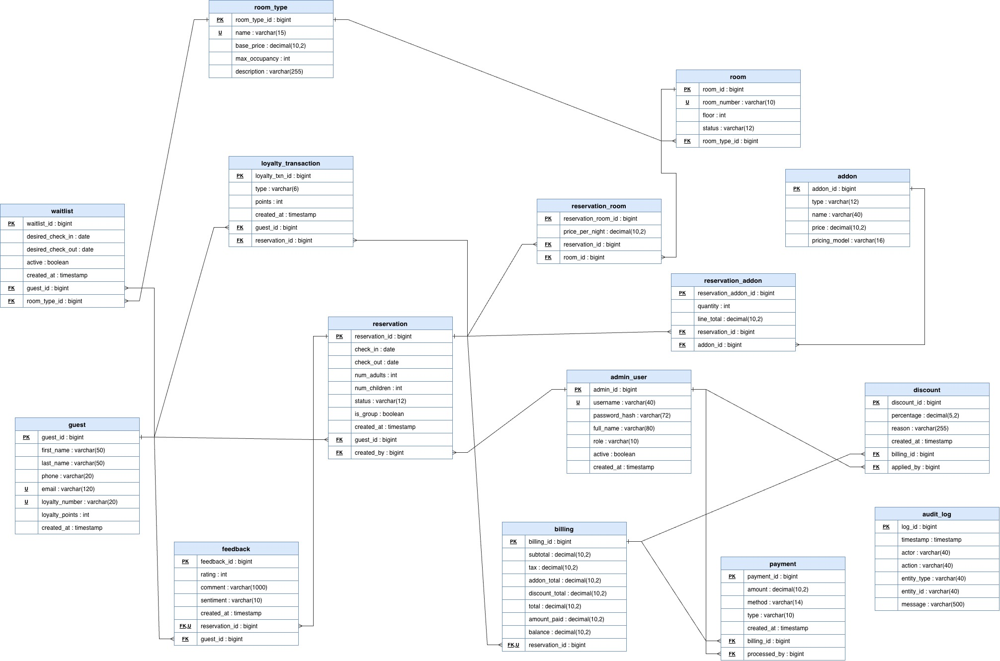

# Maplewood Grand Hotel — Reservation System

A desktop hotel reservation system built with **JavaFX**, featuring a guest-facing self-service kiosk and a staff-facing admin console, wrapped in a warm gold-and-navy hotel brand theme.

The app opens on a launcher screen where every part of the system is one click away — the full guest booking flow on one side, and the front-desk tools on the other.

  

---

## Features

### Guest Kiosk (self-service)

A complete six-step booking flow, styled for a touch-screen lobby kiosk:

1. **Welcome** — branded landing screen with a promo video player (play/pause, seek bar, mute, fullscreen), a live clock, and a *Start New Booking* call to action.
2. **Guests & Dates** — adult/children steppers with sensible limits, calendar pickers that block past dates and invalid check-out dates, and a live night counter.
3. **Room Selection** — four room types (Single, Double, Deluxe, Penthouse) with photos, descriptions, and per-night pricing. Selecting a room highlights its card; a quantity stepper supports multi-room bookings.
4. **Add-ons** — Wi-Fi, breakfast, parking (per night) and a spa package (per stay). The subtotal is calculated against the actual number of nights in the booking.
5. **Review & Confirm** — guest details form with validation (name and phone required, email format-checked) beside a live estimate: room subtotal, add-ons, loyalty discount, 13% tax, and total.
6. **Confirmation** — personalized thank-you, generated confirmation code (e.g. `MPL-2026-4471`), simulated email receipt, and a *Done* button that resets the kiosk for the next guest.

Booking data flows through every step via a shared `BookingSession`, so the estimate and confirmation always reflect the guest's real choices.

### Admin Console (front desk)

- **Login** — staff sign-in with live role detection as the username is typed, failed-attempt tracking with a three-strike warning, and console-logged login attempts.
- **Reservations Dashboard** — a searchable, filterable, paginated table of reservations. Search by guest, reservation number, or phone; filter by status, room type, and check-in date range; browse six rows per page. Double-click any row to open it.
- **Reservation Detail** — edit stay dates and party size with live re-billing, an occupancy rule that suggests the right number of rooms and flags overcapacity, a per-room breakdown table, manager-only 10% discounts, and *Save Changes* that writes back to the dashboard.
- **Payment & Checkout** — record deposits, partial payments, full payments, and refunds against a per-reservation ledger, with validation against overpayment and over-refunding. Amounts are color-coded, totals live in stat chips (the balance chip turns green when settled), and checkout is blocked until the balance reaches zero — after which the reservation is marked checked-out and its rooms are freed.

### Demo accounts

| Username  | Password    | Role       |
|-----------|-------------|------------|
| `m.reyes` | `maple123`  | Manager    |
| `a.singh` | `desk123`   | Front Desk |

Only managers can apply discounts on the reservation detail page.

---

## Tech Stack

- **Java 21**
- **JavaFX 21** — `javafx-controls`, `javafx-fxml`, `javafx-media`
- **FXML** for all screen layouts, one controller class per screen
- **CSS** — a single shared stylesheet (`kiosk.css`) defines the brand: cream backgrounds, gold accents (`#c5a059`), navy headings (`#14213d`), serif display type
- **Maven** for build and dependency management

## Project Structure

```
src/main/java/ca/senecacollege/hotelreservation/hotelreservation/
├── HelloApplication.java            # entry point, opens the launcher
├── LauncherMenu.java                # launcher screen controller
├── SceneNavigator.java              # one-line scene switching between pages
│
├── WelcomePage.java                 # kiosk screens
├── GuestsDatesPage.java
├── RoomSelectionPage.java
├── AddonsPage.java
├── ReviewConfirmPage.java
├── ConfirmationPage.java
├── BookingSession.java              # in-progress booking state, shared across steps
│
├── AdminLoginPage.java              # admin screens
├── AdminDashboardPage.java
├── AdminReservationDetailPage.java
├── AdminPaymentPage.java
├── AdminSession.java                # logged-in staff member
├── Reservation.java                 # reservation model
├── Payment.java                     # payment/refund record
└── ReservationStore.java            # shared in-memory data store + payment ledger

src/main/resources/ca/senecacollege/hotelreservation/hotelreservation/
├── launcher-menu.fxml
├── kiosk-welcome.fxml
├── kiosk-guests-dates.fxml
├── kiosk-room-selection.fxml
├── kiosk-addons.fxml
├── kiosk-review.fxml
├── kiosk-confirmation.fxml
├── admin-login.fxml
├── admin-dashboard.fxml
├── admin-reservation-detail.fxml
├── admin-payment.fxml
└── kiosk.css                        # shared theme stylesheet

src/main/resources/
├── lobby-background.jpg             # backdrop used across screens
├── double_room.jpg  single_room.jpg
├── delux-room.jpg   pent_house.jpg
└── lobby-video.mp4                  # optional welcome-screen video
```

## Design Diagrams

| Diagram | File | Description |
|---------|------|-------------|
| Class Diagram | [`docs/class-diagram.pdf`](docs/class-diagram.pdf) | UML class diagram showing model, session, and controller relationships |
| Entity-Relationship Diagram | [`docs/schema.drawio`](docs/schema.drawio) | ERD for the hotel database schema (open with [draw.io](https://app.diagrams.net)) |
| ERD Preview | [`docs/schema.jpg`](docs/schema.jpg) | PNG preview of the ERD |



---

## Architecture Notes

- **Navigation** — `SceneNavigator.go(node, "page.fxml")` swaps the scene root in place, so the window keeps its size and position while moving between screens.
- **State** — `BookingSession` carries the guest's booking through the kiosk; `AdminSession` tracks the signed-in staff member; `ReservationStore` holds reservations and the payment ledger in memory and is shared by the dashboard, detail, and payment screens, so edits on one screen appear on the others. Swapping the store for a database layer is the intended next step.
- **Tables without reflection** — table columns use lambda cell-value factories instead of `PropertyValueFactory`, which keeps the module system happy (no `opens ... to javafx.base` required).
- **FXML gotcha handled** — `$` is a variable-reference prefix in FXML, so all price text containing dollar signs is set from the controllers.

## Getting Started

### Requirements

- JDK 21+
- Maven (or use the included `mvnw` wrapper)

### Run

```bash
./mvnw clean javafx:run
```

Or open the project in IntelliJ IDEA and run `HelloApplication`.

### module-info.java

Make sure the module descriptor includes:

```java
requires javafx.controls;
requires javafx.fxml;
requires javafx.media;

opens ca.senecacollege.hotelreservation.hotelreservation to javafx.fxml;
exports ca.senecacollege.hotelreservation.hotelreservation;
```

## Roadmap

- Waitlist management
- Guest feedback collection
- Reports and occupancy analytics
- Loyalty program management
- Database persistence (replacing the in-memory store) with hashed credentials
- Rules & Regulations content screen

## Notes

Reservation data, payments, and login credentials are in-memory sample data intended for demonstration; nothing is persisted between runs and no real emails or transactions are sent.
